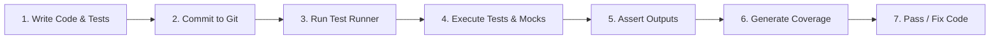

# Documentation: Python CI Checks | Unit Testing

## Author Information

| **Author** | **Created On** | **Version** | **L0 Reviewer** | **L1 Reviewer** | **L2 Reviewer** |
| ---------------- | -------------------- | ----------------- | --------------------- | --------------------- | --------------------- |
| Vikas            | 05-10-2026           | 1.0               | Shubham Rathi / Sunny | Shreya J / Nikita     | Piyush Upadhyay       |

---

# Table of Contents

1. [Introduction](#1-introduction)
2. [What is Unit Testing](#2-what-is-unit-testing)
3. [Why Unit Testing](#3-why-unit-testing)
4. [Unit Testing Workflow](#4-unit-testing-workflow)
   - [4.1 Workflow Diagram](#41-workflow-diagram)
   - [4.2 Workflow Explanation](#42-workflow-explanation)
5. [Different Tools for Python Unit Testing](#5-different-tools-for-python-unit-testing)
6. [Comparison of Unit Testing Tools](#6-comparison-of-unit-testing-tools)
7. [Advantages of Unit Testing](#7-advantages-of-unit-testing)
8. [Proof of Concept (POC)](#8-proof-of-concept-poc)
9. [Best Practices](#9-best-practices)
10. [Recommendation](#10-recommendation)
11. [Conclusion](#11-conclusion)
12. [Contact Information](#12-contact-information)
13. [References](#13-references)

---

# 1. Introduction

This document provides a guide to implement Unit Testing for Python web applications.
It covers testing strategies, tool evaluation, workflow, and best practices for Python CI checks across Attendance and Notification services.

---

# 2. What is Unit Testing

- Unit testing tests individual functions, modules, and classes in isolation.
- It tests attendance calculation, notification dispatch, and error handling.
- It verifies that small units of code work as expected.
- It runs quickly without connecting to real databases or networks.

---

# 3. Why Unit Testing

Unit testing detects backend logic bugs early before code reaches production.

| Reason                          | Description                                                    |
| ------------------------------- | -------------------------------------------------------------- |
| **Early Bug Detection**   | Finds logic and calculation bugs during development.           |
| **Service Stability**     | Ensures attendance and notification services work as designed. |
| **Regression Prevention** | Stops existing features from breaking when code changes.       |
| **Fast Feedback**         | Gives instant feedback to developers in seconds.               |
| **Safe Refactoring**      | Allows developers to clean up code with high confidence.       |

---

# 4. Unit Testing Workflow

The Unit Testing workflow executes automated tests against Python services during the CI build.

### 4.1 Workflow Diagram

### 4.2 Workflow Explanation

|    Step    | Stage                           | Description                                                            |
| :---------: | ------------------------------- | ---------------------------------------------------------------------- |
| **1** | **Write Code & Tests**    | Developer creates Python code and unit test files (`test_*.py`).     |
| **2** | **Commit to Git**         | Code and tests are committed and pushed to the repository.             |
| **3** | **Run Test Runner**       | The CI pipeline triggers the test suite with`pytest`.                |
| **4** | **Execute Tests & Mocks** | Test utility runs functions and mocks external services and databases. |
| **5** | **Assert Outputs**        | Test runner validates return values, errors, and logic.                |
| **6** | **Generate Coverage**     | The tool calculates line, branch, and function code coverage.          |
| **7** | **Pass / Fix Code**       | Build passes if all tests succeed, or developer fixes failed tests.    |

---

# 5. Different Tools for Python Unit Testing

| Tool                  | Description                                                                    |
| --------------------- | ------------------------------------------------------------------------------ |
| **Pytest**      | Popular Python test runner with simple assertions, fixtures, and rich plugins. |
| **Unittest**    | Built-in Python testing framework with a class-based test structure.           |
| **Pytest-cov**  | Coverage plugin that measures line and branch code coverage.                   |
| **Pytest-mock** | Clean mocking library for external APIs and database calls.                    |

---

# 6. Comparison of Unit Testing Tools

| Feature                            | Pytest + Pytest-cov         | Unittest                              | Nose2                    |
| ---------------------------------- | --------------------------- | ------------------------------------- | ------------------------ |
| **License**                  | Open Source (Free)          | Open Source (Free)                    | Open Source (Free)       |
| **Primary Focus**            | Modern Python Unit Testing  | Standard Library Testing              | General Python Testing   |
| **Python Ecosystem Support** | Industry Standard (Default) | High (Built-in)                       | Low                      |
| **Mocking Integration**      | Easy (`pytest-mock`)      | Built-in (`unittest.mock`)          | Requires configuration   |
| **Code Coverage**            | Built-in (`pytest-cov`)   | Requires external tool (`coverage`) | Requires external plugin |
| **CI/CD Integration**        | High                        | High                                  | Medium                   |
| **Ease of Setup**            | Easy                        | Zero Config (Built-in)                | Moderate                 |

---

# 7. Advantages of Unit Testing

| Advantage                       | Description                                                  |
| ------------------------------- | ------------------------------------------------------------ |
| **Clean Mocking**         | Easily mocks external notification APIs and database calls.  |
| **Fast Execution**        | Tests run in memory within seconds without server overhead.  |
| **Detailed Coverage**     | Shows exact percentages of tested code and missing branches. |
| **Automated in CI/CD**    | Fails pull requests automatically if any test breaks.        |
| **Lower Bug Fixing Cost** | Catches errors before code reaches QA or production.         |

---

# 8. Proof of Concept (POC)

A Proof of Concept (POC) is performed on Python microservices (Attendance & Notification).

For full execution steps, refer to the [POC](https://github.com/SnaatakAllStars/Sprint-2/blob/SCRUM-146-VIKAS/Documentation/Application_CI_Design/CI_Checks/Python/Unit_Testing/POC/README.md).

> *Note: The hands-on POC code and CI pipeline implementation will be executed in the next ticket.*

---

# 9. Best Practices

| Best Practice                            | Description                                                           |
| ---------------------------------------- | --------------------------------------------------------------------- |
| **Test Logic, Not Implementation** | Test inputs and outputs rather than internal code details.            |
| **Keep Tests Isolated**            | Ensure tests do not depend on each other.                             |
| **Mock External APIs**             | Mock HTTP network and database calls to keep tests reliable and fast. |
| **Maintain Quality Thresholds**    | Enforce a minimum 80% code coverage rule in CI.                       |
| **Run on Every Pull Request**      | Automate test runs on every pull request before merging.              |

---

# 10. Recommendation

| Parameter                     | Details                                                                                       |
| ----------------------------- | --------------------------------------------------------------------------------------------- |
| **Recommended Tool**    | **Pytest + Pytest-cov + Pytest-mock**                                                   |
| **Target Application**  | Python Microservices (Attendance & Notification)                                              |
| **Execution Command**   | `pytest --cov=. --cov-report=term-missing --cov-fail-under=80`                              |
| **Virtual Environment** | Isolated virtual environment (venv / pipenv / poetry)                                         |
| **CI/CD Integration**   | High (Easy integration into Jenkins and GitHub Actions)                                       |
| **Key Reason**          | Industry standard in Python with simple assertions, powerful fixtures, and built-in coverage. |

---

# 11. Conclusion

Unit Testing ensures high code quality, stability, and reliability for Python microservices.

**Chosen Tool:**
We choose **Pytest with Pytest-cov and Pytest-mock** as our unit testing solution for the Attendance and Notification services. It is the industry standard, tests core logic, runs fast in CI pipelines, and provides built-in code coverage reports.

---

# 12. Contact Information

|      Name      |        Email Address        |
| :-------------: | :--------------------------: |
| **Vikas** | vikas.snaatak@mygurukulam.co |

---

# 13. References

| Reference                              | Link                                                     |
| -------------------------------------- | -------------------------------------------------------- |
| **Pytest**                       | [Pytest](https://docs.pytest.org/)                        |
| **Pytest-cov**                   | [Pytest-cov](https://pytest-cov.readthedocs.io/)          |
| **Pytest-mock**                  | [Pytest-mock](https://pytest-mock.readthedocs.io/)        |
| **Python Testing Documentation** | [Python](https://docs.python.org/3/library/unittest.html) |
